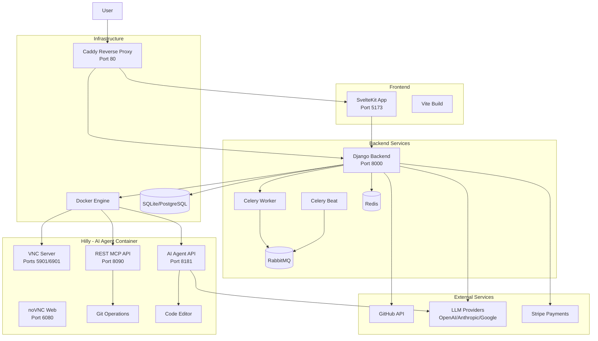
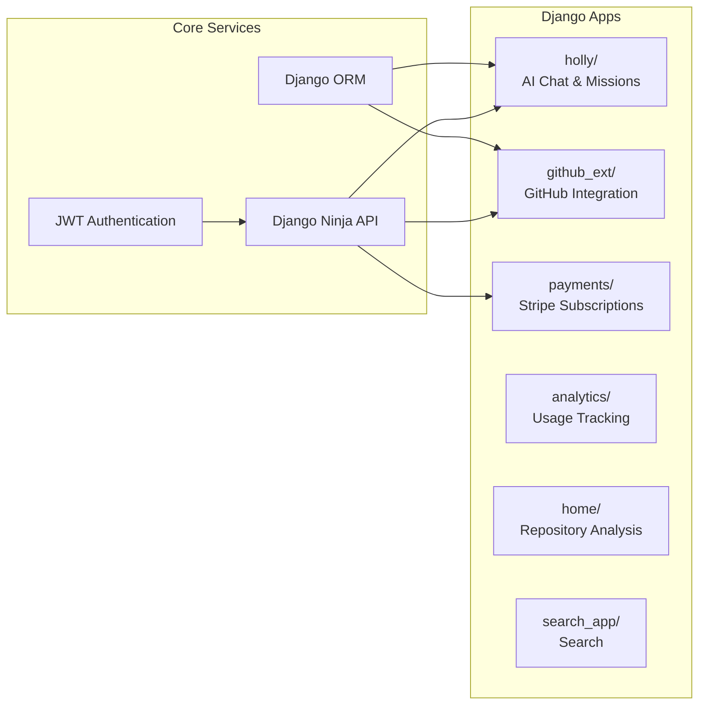
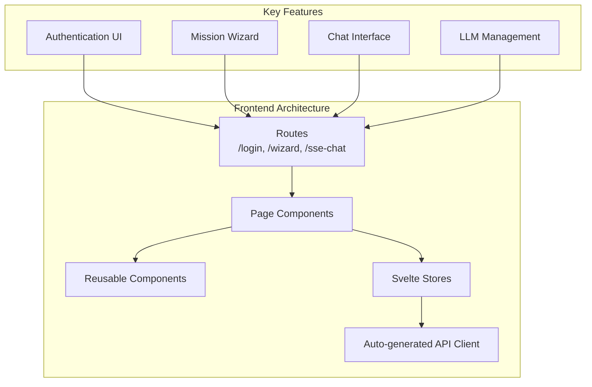
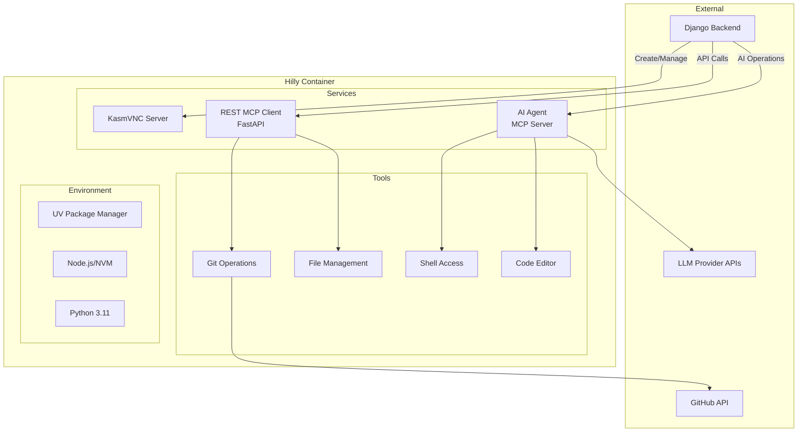

# Contributing to Holly

Thank you for your interest in contributing to Holly! This document provides guidelines and instructions for developers who want to contribute to this project.

## Table of Contents

1. [Architecture Overview](#architecture-overview)
2. [Local Development Setup](#local-development-setup)
3. [Debugging Setup](#debugging-setup)
4. [Code Quality and Linting](#code-quality-and-linting)
5. [Testing](#testing)
6. [Pull Request Guidelines](#pull-request-guidelines)
7. [Code Style](#code-style)

---

## Architecture Overview

Holly is a full-stack application with three main components:

1. **Django Backend** - REST API and business logic
2. **SvelteKit Frontend** - User interface
3. **Hilly (AI Agent Container)** - Containerized environment where AI clones and edits code

### System Architecture



### Component Details

#### Django Backend (`backend/`)

The Django backend provides:
- REST APIs via Django Ninja
- GitHub OAuth authentication
- Mission and conversation management
- Stripe payment processing
- Container orchestration for Hilly instances



#### SvelteKit Frontend (`frontend/`)

The frontend is built with:
- SvelteKit with TypeScript
- TailwindCSS + Flowbite components
- Auto-generated API client from OpenAPI spec



#### Hilly - AI Agent Container (`hilly/`)

Hilly is a containerized environment based on KasmVNC that:
- Provides a full Linux desktop environment
- Clones and edits code repositories
- Runs AI agent operations
- Exposes APIs for the Django backend to communicate



---

## Local Development Setup

### Prerequisites

Ensure you have the following installed:

- **Python 3.11** (required, not 3.12+)
- **Node.js 18+** (LTS recommended)
- **uv** - Python package manager (https://github.com/astral-sh/uv)
- **Docker** and **Docker Compose**
- **Git**

### Step 1: Clone the Repository

```bash
git clone https://github.com/your-org/holly.git
cd holly

# Initialize and update submodules
git submodule init
git submodule update
```

### Step 2: Set Up the Django Backend

```bash
# Install Python dependencies with uv
uv sync

# Create environment file
cp .env.example .env.local  # or create from scratch

# Add required environment variables to .env.local:
# DJANGO_SETTINGS_MODULE=config.settings.local
# SECRET_KEY=your-secret-key
# GITHUB_CLIENT_ID=your-github-client-id
# GITHUB_CLIENT_SECRET=your-github-client-secret
# OPENAI_API_KEY=your-openai-key (optional)
# ANTHROPIC_API_KEY=your-anthropic-key (optional)

# Activate the virtual environment
source .venv/bin/activate

# Run database migrations
python manage.py migrate

# Create a superuser (optional, for admin access)
python manage.py createsuperuser

# Collect static files (for production-like setup)
python manage.py collectstatic --noinput

# Start the Django development server
python manage.py runserver
```

The Django server will be available at `http://localhost:8000`.

### Step 3: Set Up the SvelteKit Frontend

```bash
# Navigate to the frontend directory
cd frontend

# Install Node.js dependencies
npm install

# Generate the API client from OpenAPI spec
# (Requires Django server to be running)
npm run api:full

# Start the development server
npm run dev
```

The frontend will be available at `http://localhost:5173`.

#### Running Frontend with Django Integration

For a more integrated development experience:

```bash
npm run dev:django
```

This script starts the Svelte dev server configured to work with the Django backend.

### Step 4: Set Up Hilly (AI Agent Container)

```bash
# Navigate to the hilly directory
cd hilly

# Build the Docker image
docker-compose build

# Start the container
docker-compose up -d
```

Hilly services will be available at:
- VNC: `localhost:6901`
- noVNC Web: `localhost:6080`
- REST MCP API: `localhost:8090`
- AI Agent API: `localhost:8181`

### Step 5: Set Up Background Services (Optional)

For Celery background tasks:

```bash
# Start Redis (required for Celery)
docker run -d -p 6379:6379 redis:7-alpine

# In separate terminals:

# Start Celery worker
celery -A config worker --loglevel=info

# Start Celery beat (for scheduled tasks)
celery -A config beat --scheduler django_celery_beat.schedulers:DatabaseScheduler --loglevel=info
```

### Complete Development Stack

To run all services together using Docker Compose:

```bash
# Development environment
docker-compose -f docker-compose.develop.yml up

# This starts:
# - Django backend
# - Caddy reverse proxy
# - Prometheus monitoring
# - Grafana dashboards
# - cAdvisor
```

### Environment Variables

Create a `.env.local` file with the following variables:

```bash
# Django
DJANGO_SETTINGS_MODULE=config.settings.local
SECRET_KEY=your-secret-key-here
DJANGO_DEBUG=True

# Database (optional, defaults to SQLite)
DATABASE_URL=sqlite:///db.sqlite3

# GitHub OAuth
GITHUB_CLIENT_ID=your-github-client-id
GITHUB_CLIENT_SECRET=your-github-client-secret

# Stripe (optional)
STRIPE_SECRET_KEY=your-stripe-secret-key
STRIPE_PUBLIC_KEY=your-stripe-public-key
STRIPE_WEBHOOK_SECRET=your-webhook-secret

# LLM APIs (at least one recommended)
OPENAI_API_KEY=your-openai-key
ANTHROPIC_API_KEY=your-anthropic-key
GOOGLE_API_KEY=your-google-key

# Repository storage
REPO_BASE_PATH=/path/to/repo/storage
```

---

## Debugging Setup

### Django Backend Debugging

#### Using VS Code

1. Install the Python extension for VS Code
2. Create `.vscode/launch.json`:

```json
{
  "version": "0.2.0",
  "configurations": [
    {
      "name": "Django: Runserver",
      "type": "debugpy",
      "request": "launch",
      "program": "${workspaceFolder}/manage.py",
      "args": ["runserver", "--noreload"],
      "django": true,
      "justMyCode": false,
      "env": {
        "DJANGO_SETTINGS_MODULE": "config.settings.local"
      }
    },
    {
      "name": "Django: Shell",
      "type": "debugpy",
      "request": "launch",
      "program": "${workspaceFolder}/manage.py",
      "args": ["shell"],
      "django": true
    },
    {
      "name": "Pytest",
      "type": "debugpy",
      "request": "launch",
      "module": "pytest",
      "args": ["-v", "-s"],
      "justMyCode": false
    }
  ]
}
```

#### Using PyCharm

1. Go to Run > Edit Configurations
2. Add a new Django Server configuration
3. Set the working directory to the project root
4. Set environment variables as needed

#### Django Debug Toolbar

The Django Debug Toolbar is included in dev dependencies. To enable:

1. Ensure `DJANGO_DEBUG=True` in your environment
2. Add your IP to `INTERNAL_IPS` in settings
3. Access any page with the toolbar visible

### Frontend Debugging

#### Browser DevTools

- Use Chrome/Firefox DevTools for debugging
- Install the Svelte DevTools browser extension
- Source maps are enabled by default in development

#### VS Code Setup

Create `.vscode/launch.json`:

```json
{
  "version": "0.2.0",
  "configurations": [
    {
      "type": "chrome",
      "request": "launch",
      "name": "Launch Chrome",
      "url": "http://localhost:5173",
      "webRoot": "${workspaceFolder}/frontend"
    }
  ]
}
```

#### Debugging API Calls

The frontend includes a GitHub API debugger accessible in development mode:

```javascript
// In browser console (dev mode only)
GitHubApiDebugger.testGitHubConnectionStatus();
```

### Hilly Container Debugging

#### Accessing the Container

```bash
# Get shell access
docker exec -it <container_id> /bin/bash

# View logs
docker logs -f <container_id>

# View supervisor logs inside container
tail -f /var/log/supervisor/*.log
```

#### REST MCP Client Debugging

```bash
# Navigate to the rest_mcp_client directory
cd hilly/rest_mcp_client

# Run tests with verbose output
uv run pytest -v -s

# Run with coverage
uv run pytest --cov=rest_mcp_client
```

### Logging

#### Django Logging

Logs are written to `logdir/` by default. Configure in settings:

```python
LOGGING = {
    'version': 1,
    'handlers': {
        'file': {
            'class': 'logging.FileHandler',
            'filename': 'logdir/django.log',
        },
    },
    'root': {
        'handlers': ['file'],
        'level': 'DEBUG',
    },
}
```

#### Frontend Logging

Use the console utilities:

```typescript
import { loggerUtils } from '$lib/utils/loggerUtils';

loggerUtils.info('Message');
loggerUtils.error('Error', error);
```

---

## Code Quality and Linting

### Pre-commit Hooks

This project uses **pre-commit** to ensure code quality. Hooks run automatically before each commit.

#### Setup Pre-commit

```bash
# Install pre-commit
pip install pre-commit

# Or with uv
uv pip install pre-commit

# Install the git hooks
pre-commit install

# Run hooks manually on all files
pre-commit run --all-files
```

#### Configured Hooks

The `.pre-commit-config.yaml` includes:

1. **General checks**:
   - `trailing-whitespace` - Remove trailing whitespace
   - `end-of-file-fixer` - Ensure files end with newline
   - `check-json` - Validate JSON files
   - `check-toml` - Validate TOML files
   - `check-yaml` - Validate YAML files
   - `check-xml` - Validate XML files
   - `debug-statements` - Detect debug statements (pdb, breakpoint)
   - `check-case-conflict` - Check for case conflicts in filenames
   - `detect-private-key` - Prevent committing private keys

2. **Prettier** (Frontend formatting):
   - Formats Svelte, JavaScript, TypeScript, JSON files
   - Uses 2-space tabs and single quotes
   - Includes TailwindCSS plugin

3. **Django Upgrade**:
   - Automatically upgrades Django code to target version (5.0)

4. **Ruff** (Python linting and formatting):
   - Fast Python linter (replaces flake8, isort, etc.)
   - Auto-fixes issues where possible
   - Formats code (replaces black)

### Python Linting with Ruff

Ruff is configured in `pyproject.toml`:

```bash
# Run linter
ruff check .

# Run linter with auto-fix
ruff check . --fix

# Format code
ruff format .
```

#### Ruff Configuration

Key settings in `pyproject.toml`:

- **Target**: Python 3.11
- **Line length**: 120 characters
- **Extensive rule set**: Including security (S), Django (DJ), type checking (TC), etc.

### Type Checking with MyPy

```bash
# Run type checking
mypy .
```

MyPy is configured for strict type checking with exceptions for migrations and tests.

### Frontend Linting

```bash
cd frontend

# Run all linting
npm run lint

# Format code with Prettier
npm run format

# Type check Svelte components
npm run check
```

### Husky Git Hooks (Frontend)

The frontend uses Husky for additional git hooks:

```bash
# Hooks are installed automatically via npm prepare
npm run prepare
```

---

## Testing

### Backend Testing

#### Running Tests

```bash
# Run all Django tests
python manage.py test

# Run with pytest (recommended)
pytest

# Run with coverage
coverage run -m pytest
coverage report
coverage html  # Generate HTML report
```

#### Test Structure

- Tests are in `*/tests/` directories within each Django app
- Use Factory Boy for test data generation
- Use pytest-django fixtures

#### Writing Tests

```python
import pytest
from factory import Factory

class MyModelFactory(Factory):
    class Meta:
        model = MyModel

    name = "Test"

@pytest.mark.django_db
def test_my_feature():
    obj = MyModelFactory()
    assert obj.name == "Test"
```

### Frontend Testing

#### Unit Tests (Vitest)

```bash
cd frontend

# Run unit tests
npm run test:unit

# Run in watch mode
npx vitest --watch
```

#### Integration Tests (Playwright)

```bash
# Run integration tests
npm run test:integration

# Or directly with Playwright
npx playwright test
```

### Hilly Container Testing

```bash
cd hilly/rest_mcp_client

# Run tests
uv run pytest

# Run with async support
uv run pytest --asyncio-mode=auto
```

---

## Pull Request Guidelines

### Before Submitting

1. **Create a feature branch**:
   ```bash
   git checkout -b feature/your-feature-name
   ```

2. **Ensure all tests pass**:
   ```bash
   pytest
   cd frontend && npm run test
   ```

3. **Run linting**:
   ```bash
   pre-commit run --all-files
   ```

4. **Update documentation** if needed

5. **Write meaningful commit messages**

### PR Description

Include:
- Summary of changes
- Related issue number (if applicable)
- Screenshots for UI changes
- Testing instructions

### Review Process

- PRs require at least one approval
- CI checks must pass
- Address review comments promptly

---

## Code Style

### Python

- Follow PEP 8 with 120 character line limit
- Use type hints for all functions
- Write docstrings for public APIs
- Prefer pathlib over os.path
- Use specific exceptions, not bare `except`

### TypeScript/Svelte

- Use TypeScript strict mode
- Prefer `$store` syntax over explicit subscriptions
- Keep components focused and small
- Use TailwindCSS for styling

### Git Commits

- Use conventional commits format:
  - `feat:` new features
  - `fix:` bug fixes
  - `docs:` documentation
  - `refactor:` code refactoring
  - `test:` tests
  - `chore:` maintenance

### Module Organization

- Keep modules under 300 lines
- Use inheritance to split large classes
- Follow SOLID principles

---

## Getting Help

- Check existing issues on GitHub
- Review the CLAUDE.md for additional context
- Ask questions in pull request discussions

Thank you for contributing to Holly!
