# GitHub App Installation Flow - Complete Sequence Diagram

## Overview

This document describes the complete GitHub App installation flow in the Holly application, including all function calls, API interactions, and data flow between the frontend (Svelte), backend (Django), and GitHub.

## Architecture Components

- **Frontend**: SvelteKit application (`frontend/`)
- **Backend**: Django + Django-Ninja REST API (`backend/holly/`)
- **GitHub OAuth**: User authentication via GitHub
- **GitHub App**: Repository access via GitHub App installation
- **Database Models**:
  - `User` - Holly application users
  - `UserGitHubAccount` - GitHub accounts linked to users (many-to-one)
  - `GitHubAccountInstallation` - App installations per GitHub account
  - `SocialAccount` - django-allauth social authentication
  - `SocialToken` - OAuth tokens storage

## Complete GitHub App Installation Sequence Diagram

```mermaid
sequenceDiagram
    actor User
    participant Browser
    participant Frontend as Svelte Frontend
    participant Backend as Django Backend
    participant GitHubOAuth as GitHub OAuth
    participant GitHubApp as GitHub (App)
    participant DB as Database
    participant Cache as Redis Cache

    %% Phase 1: GitHub OAuth Connection
    rect rgb(230, 245, 255)
        Note over User,Cache: Phase 1: OAuth Connection (Connect GitHub Account)

        User->>Browser: Navigate to /github/connect
        Browser->>Frontend: Load GitHubConnectPage
        activate Frontend
        Frontend->>Frontend: getGitHubConnectionStatus()
        Frontend->>Backend: GET /api/users/github/connection-status
        activate Backend
        Backend->>Backend: get_github_connection_status()
        Backend->>DB: User.get_primary_github_account()
        DB-->>Backend: UserGitHubAccount | None
        Backend-->>Frontend: ConnectionStatusResponse<br/>{is_connected, primary_account, total_accounts}
        deactivate Backend
        Frontend-->>Browser: Display connection status
        deactivate Frontend

        User->>Browser: Click "Connect to GitHub"
        Browser->>Frontend: connectToGitHub()
        activate Frontend
        Frontend->>Frontend: startGitHubOAuthFlow('/github/connect')
        Frontend->>Frontend: initiateGitHubOAuth(redirectUrl)
        Frontend->>Backend: POST /api/users/github/oauth/initiate<br/>{redirect_url: '/github/connect'}
        activate Backend
        Backend->>Backend: initiate_github_oauth(request, data)
        Backend->>Backend: GitHubOAuthService.__init__(request)
        Backend->>Backend: generate_oauth_url(user, redirect_url, scopes)
        Backend->>Backend: secrets.token_urlsafe(32) → state
        Backend->>Cache: SET github_oauth_state:{state}<br/>{user_id, redirect_url, timestamp}<br/>TTL: 600s
        Cache-->>Backend: OK
        Backend->>Backend: Build OAuth URL with params:<br/>client_id, redirect_uri, scope, state
        Backend-->>Frontend: GitHubOAuthInitiateResponse<br/>{oauth_url, state}
        deactivate Backend
        Frontend->>Browser: window.location.href = oauth_url
        deactivate Frontend

        Browser->>GitHubOAuth: Redirect to GitHub OAuth<br/>https://github.com/login/oauth/authorize<br/>?client_id={id}&redirect_uri={uri}&scope=user,repo&state={state}
        activate GitHubOAuth
        GitHubOAuth->>User: Display authorization page
        User->>GitHubOAuth: Approve authorization
        GitHubOAuth->>Browser: Redirect to callback<br/>{FRONTEND_URL}/github/oauth/callback<br/>?code={code}&state={state}
        deactivate GitHubOAuth

        Browser->>Frontend: Load /github/oauth/callback
        activate Frontend
        Frontend->>Frontend: Extract code & state from URL params
        Frontend->>Frontend: handleGitHubOAuthCallback(code, state)
        Frontend->>Backend: POST /api/users/github/oauth/callback<br/>{code, state}
        activate Backend
        Backend->>Backend: handle_github_oauth_callback(request, data)
        Backend->>Backend: GitHubOAuthService.handle_oauth_callback(code, state)
        Backend->>Cache: GET github_oauth_state:{state}
        Cache-->>Backend: {user_id, redirect_url, timestamp}
        Backend->>Cache: DELETE github_oauth_state:{state}
        Backend->>DB: User.objects.get(id=user_id)
        DB-->>Backend: User instance
        Backend->>GitHubOAuth: POST /login/oauth/access_token<br/>{client_id, client_secret, code}
        activate GitHubOAuth
        GitHubOAuth-->>Backend: {access_token, scope, token_type}
        deactivate GitHubOAuth
        Backend->>GitHubOAuth: GET /user<br/>Authorization: token {access_token}
        activate GitHubOAuth
        GitHubOAuth-->>Backend: GitHub user data<br/>{login, id, avatar_url, ...}
        deactivate GitHubOAuth
        Backend->>Backend: _create_or_update_github_account()
        Backend->>DB: SocialApp.get_or_create(provider='github')
        DB-->>Backend: SocialApp instance
        Backend->>DB: SocialAccount.get_or_create<br/>(provider='github', uid={github_id})
        DB-->>Backend: SocialAccount instance
        Backend->>DB: SocialToken.update_or_create<br/>(account, app, token={access_token})
        DB-->>Backend: SocialToken instance
        Backend->>DB: UserGitHubAccount.update_or_create<br/>(user, social_account, github_login, is_primary)
        DB-->>Backend: UserGitHubAccount instance
        Backend-->>Frontend: GitHubOAuthCallbackResponse<br/>{success, message, account_info, redirect_url}
        deactivate Backend
        Frontend-->>Browser: Display success message with account info
        deactivate Frontend
    end

    %% Phase 2: GitHub App Installation
    rect rgb(255, 245, 230)
        Note over User,Cache: Phase 2: GitHub App Installation (Repository Access)

        User->>Browser: Navigate to GitHub management page
        Browser->>Frontend: Load GitHubAppPage component
        activate Frontend
        Frontend->>Frontend: onMount() - Initialize installations
        Frontend->>Frontend: getInstallationUrl()
        Frontend->>Backend: GET /api/github/install-url
        activate Backend
        Backend->>Backend: get_installation_url(request)
        Backend->>DB: request.user.get_primary_github_account()
        DB-->>Backend: UserGitHubAccount | None
        Backend->>Backend: Generate state = f"{user.id}_{int(time.time())}"
        Backend->>Backend: request.session['github_app_install_state'] = state
        Backend->>Backend: GitHubAppIntegration().__init__()
        Backend->>Backend: Load GITHUB_APP_PRIVATE_KEY from file
        Backend->>Backend: get_installation_url(state)
        Backend->>Backend: Build URL:<br/>https://github.com/apps/{app_name}/installations/new?state={state}
        Backend-->>Frontend: InstallationUrlResponseSchema<br/>{install_url, state}
        deactivate Backend
        Frontend-->>Browser: Ready to install app
        deactivate Frontend

        User->>Browser: Click "Install GitHub App"
        Browser->>GitHubApp: Open installation URL in new window<br/>https://github.com/apps/{app_name}/installations/new?state={state}
        activate GitHubApp
        GitHubApp->>User: Display app installation page<br/>(select repositories)
        User->>GitHubApp: Select repositories & confirm installation
        GitHubApp->>GitHubApp: Create installation with ID
        GitHubApp->>Browser: Redirect to callback<br/>{FRONTEND_URL}/github/app/callback<br/>?installation_id={id}&state={state}&setup_action=install
        deactivate GitHubApp

        Browser->>Frontend: Load /github/app/callback
        activate Frontend
        Frontend->>Frontend: Extract installation_id, state, setup_action
        Frontend->>Frontend: Validate parameters present
        Frontend->>Frontend: handleInstallationCallback({installation_id, state})
        Frontend->>Backend: POST /api/github/handle-callback<br/>{installation_id, state}
        activate Backend
        Backend->>Backend: handle_installation_callback(request, payload)

        %% State validation
        Backend->>Backend: Verify CSRF state parameter
        Backend->>Backend: session_state = request.session.get('github_app_install_state')
        Backend->>Backend: Compare session_state == payload.state
        Backend->>Backend: Extract user_id from state: state.split('_')[0]
        Backend->>Backend: Verify user_id == request.user.id

        Backend->>DB: request.user.get_primary_github_account()
        DB-->>Backend: UserGitHubAccount (primary)
        Backend->>Backend: GitHubAppIntegration().__init__()
        Backend->>Backend: generate_jwt()
        Backend->>Backend: Create JWT payload:<br/>{iat: now-60, exp: now+540, iss: app_id}
        Backend->>Backend: jwt.encode(payload, private_key, "RS256")
        Backend->>Backend: get_installation_info(installation_id)
        Backend->>GitHubApp: GET /app/installations/{installation_id}<br/>Authorization: Bearer {jwt_token}
        activate GitHubApp
        GitHubApp-->>Backend: Installation info<br/>{account: {login, type}, permissions, repository_selection}
        deactivate GitHubApp
        Backend->>DB: GitHubAccountInstallation.update_or_create<br/>(user_github_account, installation_id,<br/>account_name, account_type, permissions)
        DB-->>Backend: GitHubAccountInstallation instance
        Backend->>Backend: del request.session['github_app_install_state']
        Backend-->>Frontend: InstallationCallbackResponseSchema<br/>{success: true, message, installation_id}
        deactivate Backend

        Frontend->>Frontend: installationsStore.fetchInstallations()
        Frontend->>Backend: GET /api/github/installations
        activate Backend
        Backend->>Backend: list_installations(request)
        Backend->>DB: request.user.get_primary_github_account()
        DB-->>Backend: UserGitHubAccount (primary)
        Backend->>DB: request.user.get_github_accounts()
        DB-->>Backend: List[UserGitHubAccount]
        Backend->>DB: GitHubAccountInstallation.objects.filter<br/>(user_github_account__in=accounts)
        DB-->>Backend: List[GitHubAccountInstallation]
        Backend-->>Frontend: InstallationsResponseSchema<br/>{is_connected, social_account, installations[]}
        deactivate Backend
        Frontend-->>Browser: Display success & refresh installations list
        Frontend->>Frontend: Clean URL params: window.history.replaceState()
        deactivate Frontend
    end

    %% Phase 3: Repository Access
    rect rgb(245, 255, 230)
        Note over User,Cache: Phase 3: Repository Access (Using Installation Tokens)

        User->>Browser: View repositories
        Browser->>Frontend: Load repository list component
        activate Frontend
        Frontend->>Frontend: getRepos(privateOnly=true)
        Frontend->>Backend: GET /api/github/repositories?private_only=true
        activate Backend
        Backend->>Backend: list_repositories(request, filters)
        Backend->>Backend: GitHubAppService(user).__init__()
        Backend->>Backend: get_best_github_auth(user)

        %% Auth Strategy 1: Try App Installation Tokens
        Backend->>Backend: get_github_app_token(user)
        Backend->>Backend: get_github_app_installations(user)
        Backend->>DB: GitHubAccountInstallation.objects.filter<br/>(user_github_account__in=accounts)
        DB-->>Backend: List[GitHubAccountInstallation]

        loop For each installation
            Backend->>Backend: GitHubAppIntegration.get_installation_token(installation_id)
            Backend->>Backend: generate_jwt()
            Backend->>GitHubApp: POST /app/installations/{id}/access_tokens<br/>Authorization: Bearer {jwt_token}
            activate GitHubApp
            GitHubApp-->>Backend: {token, expires_at}
            deactivate GitHubApp
            Backend->>Backend: Store (token, installation_id)
        end

        Backend->>Backend: list_repositories() - Try installation tokens
        Backend->>GitHubApp: GET /installation/repositories<br/>Authorization: token {installation_token}
        activate GitHubApp
        GitHubApp-->>Backend: {repositories: [...]}
        deactivate GitHubApp

        %% Auth Strategy 2: Fallback to OAuth if no app tokens
        alt No installation tokens
            Backend->>Backend: get_github_oauth_token(user)
            Backend->>DB: primary_account.get_token()
            DB->>DB: SocialToken.objects.get(account=social_account)
            DB-->>Backend: OAuth token
            Backend->>GitHubApp: GET /user/installations<br/>Authorization: Bearer {oauth_token}
            activate GitHubApp
            GitHubApp-->>Backend: {installations: [{id, ...}]}
            deactivate GitHubApp

            loop For each discovered installation
                Backend->>Backend: Mint installation token via JWT
                Backend->>GitHubApp: GET /installation/repositories<br/>Authorization: token {installation_token}
                activate GitHubApp
                GitHubApp-->>Backend: {repositories: [...]}
                deactivate GitHubApp
            end
        end

        %% Auth Strategy 3: Final fallback to user repos
        alt Still no repositories
            Backend->>GitHubApp: GET /user/repos?per_page=100&affiliation=owner,collaborator<br/>Authorization: Bearer {oauth_token}
            activate GitHubApp
            GitHubApp-->>Backend: [repositories...]
            deactivate GitHubApp
        end

        Backend->>Backend: Filter by private_only if requested
        Backend-->>Frontend: List[RepositorySchema]
        deactivate Backend
        Frontend-->>Browser: Display repository grid
        deactivate Frontend
    end
```



## Key Function Calls Reference

### Frontend Functions

#### GitHub OAuth Flow
- **File**: `frontend/src/routes/github/connect/+page.svelte`
  - `getGitHubConnectionStatus()` → Checks current OAuth status
  - `connectToGitHub()` → Initiates OAuth flow
  - `startGitHubOAuthFlow(redirectUrl)` → Calls initiate endpoint

- **File**: `frontend/src/lib/apis/users/github-oauth.ts`
  - `initiateGitHubOAuth(redirectUrl, scopes)` → POST `/api/users/github/oauth/initiate`
  - `handleGitHubOAuthCallback(code, state)` → POST `/api/users/github/oauth/callback`
  - `getGitHubConnectionStatus()` → GET `/api/users/github/connection-status`
  - `listGitHubAccounts()` → GET `/api/users/github/accounts`
  - `disconnectGitHubAccount(githubLogin)` → POST `/api/users/github/disconnect`
  - `setPrimaryGitHubAccount(githubLogin)` → POST `/api/users/github/set-primary`

#### GitHub App Installation Flow
- **File**: `frontend/src/routes/github/app/callback/+page.svelte`
  - `handleInstallationCallback({installation_id, state})` → Processes callback

- **File**: `frontend/src/lib/apis/github/api.github.ts`
  - `getInstallationUrl()` → GET `/api/github/install-url`
  - `handleInstallationCallback(request)` → POST `/api/github/handle-callback`
  - `getInstallations()` → GET `/api/github/installations`
  - `getInstallationStatus(installationId)` → GET `/api/github/installation-status/{id}`
  - `getRepos(privateOnly)` → GET `/api/github/repositories?private_only={bool}`

#### Token Management
- **File**: `frontend/src/lib/apis/auth/token-manager.ts`
  - `withTokenRefresh(apiCall)` → Wraps API calls with automatic token refresh
  - `TokenManager.refreshAccessToken()` → Refreshes expired JWT
  - `TokenManager.executeWithTokenRefresh(apiCall)` → Handles 401 errors and retries

### Backend API Endpoints

#### OAuth Endpoints (`backend/holly/users/api/router.py`)
1. `POST /api/users/github/oauth/initiate` → `initiate_github_oauth()`
2. `POST /api/users/github/oauth/callback` → `handle_github_oauth_callback()`
3. `GET /api/users/github/connection-status` → `get_github_connection_status()`
4. `GET /api/users/github/accounts` → `list_github_accounts()`
5. `POST /api/users/github/disconnect` → `disconnect_github_account()`
6. `POST /api/users/github/set-primary` → `set_primary_github_account()`

#### GitHub App Endpoints (`backend/holly/github_ext/api/router.py`)
1. `GET /api/github/repositories` → `list_repositories()`
2. `GET /api/github/repository/{github_id}` → `get_repository()`
3. `GET /api/github/installations` → `list_installations()`
4. `GET /api/github/install-url` → `get_installation_url()`
5. `POST /api/github/handle-callback` → `handle_installation_callback()`
6. `GET /api/github/installation-status/{installation_id}` → `get_installation_status()`
7. `POST /api/github/pull-request/{mission_conversation_id}` → `create_pull_request()`

### Backend Service Functions

#### GitHubOAuthService (`backend/holly/users/services/github_oauth_service.py`)
- `__init__(request)` → Initialize with GitHub OAuth app config
- `generate_oauth_url(user, redirect_url, scopes)` → Generate OAuth URL with state
- `handle_oauth_callback(code, state)` → Process OAuth callback
- `disconnect_github_account(user, github_login)` → Disconnect account
- `set_primary_account(user, github_login)` → Set primary account
- `_get_callback_url()` → Get frontend callback URL
- `_exchange_code_for_token(code)` → Exchange code for access token
- `_get_github_user_info(access_token)` → Get user info from GitHub
- `_create_or_update_github_account(user, access_token, github_user_data, token_data)` → Create/update models

#### GitHubAppIntegration (`backend/holly/github_ext/github_apps.py`)
- `__init__()` → Load app credentials and private key
- `generate_jwt()` → Create JWT for GitHub App authentication
- `get_installation_info(installation_id)` → Get installation details
- `get_installation_token(installation_id)` → Mint installation access token
- `get_installation_url(state)` → Generate app installation URL

#### GitHubAppService (`backend/holly/github_ext/services/github_app_service.py`)
- `__init__(user)` → Initialize with user and get best auth
- `list_repositories()` → List repos with fallback auth strategy
- `get_repository_by_id(github_id)` → Get specific repo by ID
- `get_repository(owner, repo)` → Get repo by owner/name
- `get_repository_contents(owner, repo, path)` → Get directory contents
- `get_file_content(owner, repo, path)` → Get file content
- `create_pull_request(owner, repo, head_branch, base_branch, title, body)` → Create PR

#### Authentication Utilities (`backend/holly/github_ext/auth_utils.py`)
- `get_github_oauth_token(user)` → Get OAuth token from primary account
- `get_github_app_installations(user)` → Get all installations for user
- `get_github_app_token(user, repository)` → Get app installation tokens
- `get_best_github_auth(user, repository)` → Get best auth with fallback strategy
- `create_auth_headers(auth_info)` → Create GitHub API headers
- `get_repository_url_with_auth(auth_info, owner, repo)` → Create authenticated git URL

### Database Models

#### User Model (`backend/holly/users/models.py`)
- `has_github_account()` → Check if user has any GitHub account
- `get_primary_github_account()` → Get primary GitHub account
- `get_github_accounts()` → Get all active GitHub accounts

#### UserGitHubAccount Model (`backend/holly/users/github_models.py`)
- **Fields**: user, social_account, github_login, github_id, avatar_url, is_primary, is_active
- `get_token()` → Get OAuth token for this account
- `refresh_account_data()` → Sync data from SocialAccount
- `create_from_social_account(user, social_account, is_primary)` → Factory method
- `save()` → Override to ensure single primary account

#### GitHubAccountInstallation Model (`backend/holly/users/github_models.py`)
- **Fields**: user_github_account, installation_id, account_name, account_type, permissions, repository_selection
- **Relationships**: Many installations per UserGitHubAccount

## Security Features

### CSRF Protection
1. **OAuth State Parameter**:
   - Generated using `secrets.token_urlsafe(32)`
   - Stored in Redis cache with 10-minute TTL
   - Validated on callback

2. **App Installation State**:
   - Format: `{user_id}_{timestamp}`
   - Stored in Django session
   - Validated against user ID on callback

### Token Security
1. **JWT Access Tokens**: 5-minute lifetime
2. **Refresh Tokens**: 1-day lifetime
3. **Automatic Token Refresh**: Frontend handles 401 errors with retry
4. **GitHub App JWT**: 9-minute expiration with clock skew handling

### Authentication Strategy (Priority Order)
1. **GitHub App Installation Tokens** (preferred - repo-scoped)
2. **OAuth User Tokens** (fallback - user-scoped)
3. **Unauthenticated** (public repos only)

## Data Flow Summary

### OAuth Connection Flow
```
User → Frontend → Backend → Cache (state) → GitHub → Backend → DB (models) → Frontend
```

### App Installation Flow
```
User → Frontend → Backend → Session (state) → GitHub → Backend → GitHub API (JWT) → DB → Frontend
```

### Repository Access Flow
```
Frontend → Backend → DB (installations) → GitHub API (JWT → install token) → GitHub (repos) → Backend → Frontend
```

## GitHub API Interactions

### OAuth Endpoints
- `POST https://github.com/login/oauth/authorize` - Initiate OAuth
- `POST https://github.com/login/oauth/access_token` - Exchange code for token
- `GET https://api.github.com/user` - Get user info

### GitHub App Endpoints (with JWT)
- `GET /app/installations/{id}` - Get installation info
- `POST /app/installations/{id}/access_tokens` - Mint installation token

### GitHub API Endpoints (with installation token)
- `GET /installation/repositories` - List installation repos
- `GET /user/installations` - List user's installations
- `GET /user/repos` - List user repos (OAuth fallback)
- `GET /repos/{owner}/{repo}` - Get repo details
- `GET /repos/{owner}/{repo}/contents/{path}` - Get file/directory
- `POST /repos/{owner}/{repo}/pulls` - Create pull request

## Error Handling

### Frontend
- Network errors → Display user-friendly messages
- 401 errors → Automatic token refresh and retry
- OAuth errors → Redirect to error page with details
- Missing parameters → Validation before API calls

### Backend
- State validation failures → Return error response
- Token exchange failures → Log and return error
- GitHub API failures → Retry with fallback auth
- Database errors → Catch and log with Loguru

## Configuration Requirements

### Environment Variables
```bash
# OAuth
GITHUB_CLIENT_ID=your_oauth_client_id
GITHUB_CLIENT_SECRET=your_oauth_client_secret

# GitHub App
GITHUB_APP_NAME=your_app_name
GITHUB_APP_ID=your_app_id
GITHUB_APP_PRIVATE_KEY_PATH=/path/to/private-key.pem

# Application
FRONTEND_URL=http://localhost:5173
DJANGO_SECRET_KEY=your_secret_key

# Cache (for OAuth state)
REDIS_URL=redis://localhost:6379/0
```

### Required Scopes
- **OAuth**: `user`, `repo`
- **App Permissions**: `contents: read/write`, `metadata: read`, `pull_requests: write`

## Multi-Account Support

The system supports multiple GitHub accounts per user:
1. User can connect multiple GitHub accounts via OAuth
2. One account marked as "primary" (default for operations)
3. Each account can have multiple app installations
4. Repository access aggregated across all accounts
5. User can switch primary account or disconnect accounts

## Notes

- All timestamps use ISO 8601 format
- State parameters use cryptographically secure random generation
- JWT tokens for GitHub App use RS256 algorithm
- OAuth tokens stored in django-allauth SocialToken model
- Installation tokens generated on-demand (not stored)
- Clock skew handled: JWT issued 1 minute in past, expires 9 minutes in future
